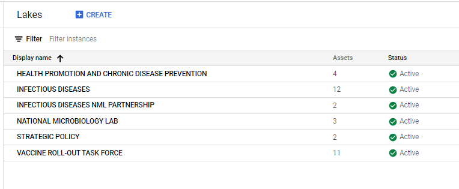
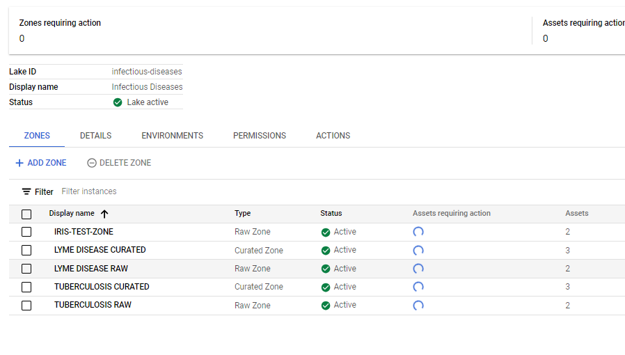
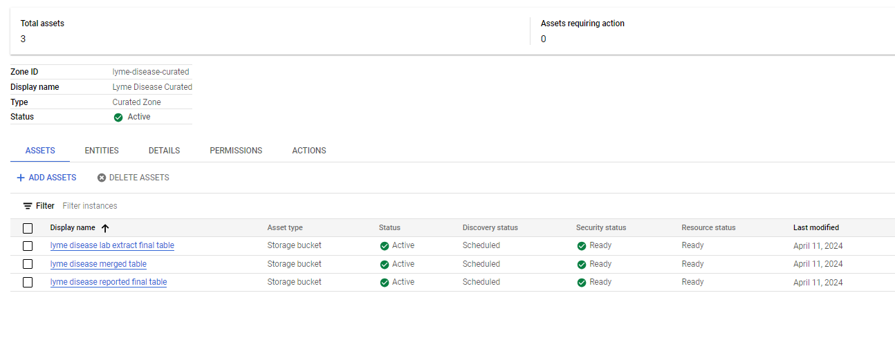
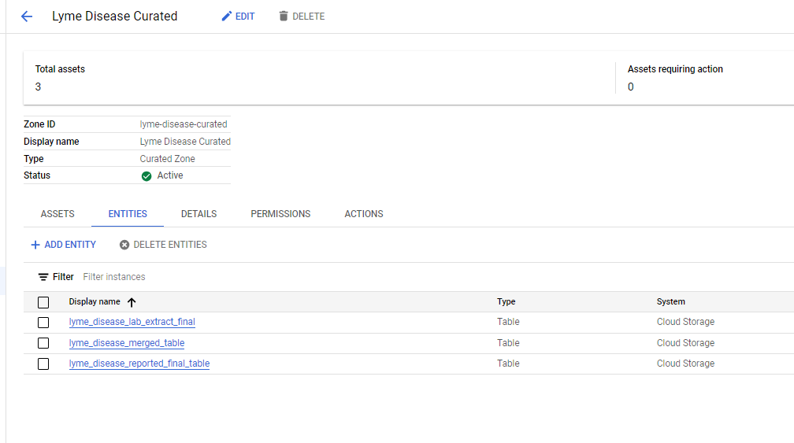
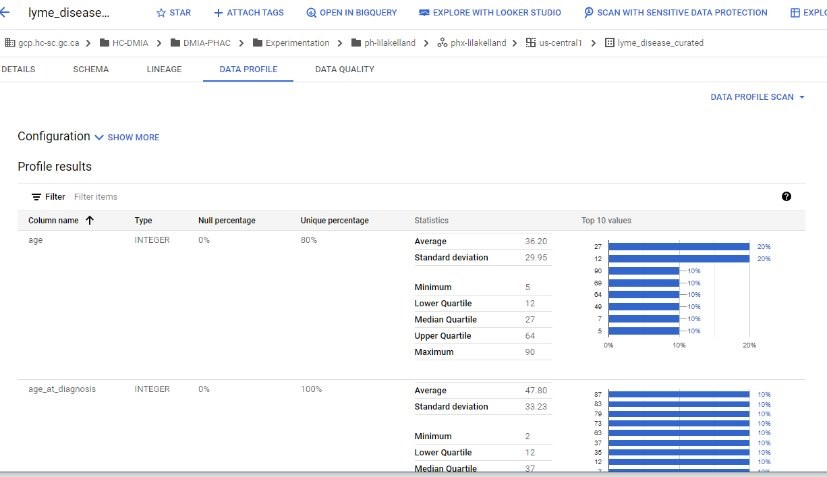
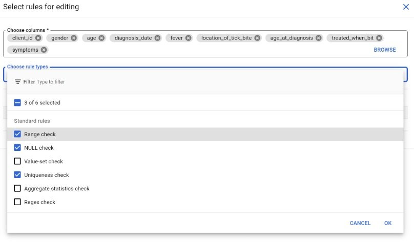
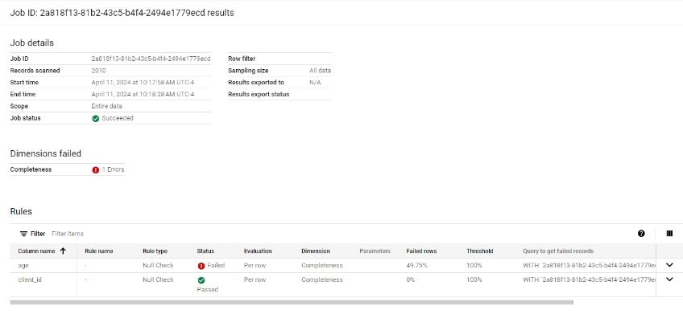
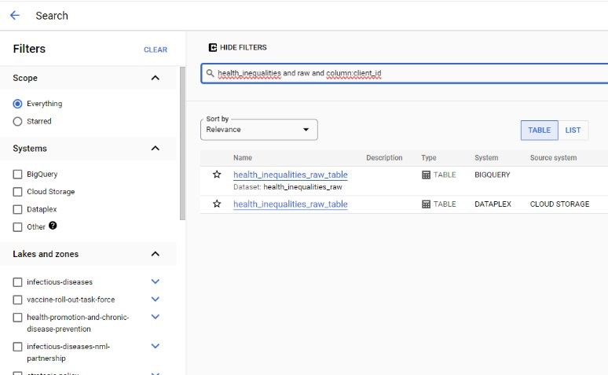

# Dataplex PoC

[Dataplex](https://cloud.google.com/blog/products/data-analytics/build-a-data-mesh-on-google-cloud-with-dataplex-now-generally-available?utm_source=youtube&utm_medium=unpaidsoc&utm_campaign=fy22q1-googlecloudevents-blog-data-description-no-brand-global&utm_content=j2hU_vkiWa0-skyvine1026739764&utm_term=-) is a Google Cloud Platform (GCP) data fabric that “[unifies distributed data and automates data management and governance for that data](https://cloud.google.com/dataplex/docs/introduction)”. 

Data products, owned and managed by the business domains (surveillance programs), can be added to the data mesh without being moved from their respective GCP projects.  The metadata and governance for the data mesh is centrally managed from the Dataplex GCP project. 

Dataplex can be used as a data catalog where the metadata/ schema is auto-extracted and kept up-to-date with the source data product, then  searchable and findable though a central console. Data quality can be ensured with the use of automated data quality checks.

In this proof-of-concept project, we explored using Dataplex to build out a PHAC data mesh/ data catalog using Google Cloud Storage buckets and Big Query.  We created lakes, zones and attached [synthetic data products](https://github.com/PHACDataHub/dataplex-poc/tree/main/generate-data) (assets) to explore the IAM flow and various capabilities. 

 

## How it works:

#### In the surveillance specific GCP project

* Data owners store their data products in Google Cloud Storage Buckets (in Parquet, Avro, CSV, line-delimited JSON, or ORC (optimized row columnar), or BigQuery tables for automated schema discovery).
* Data owners assign permission to the dataplex project's service account with the Dataplex Service Agent role on the bucket, Big Query table (or project wide). This will allow Dataplex permissions to the data to extract the schema and metadata, as well as to manage IAM to the data from within the dataplex project (access would be granted by the data owner for that asset/ zone).

#### In the Dataplex Project

* Set up the Lakes (this is done by the Dataplex Admin), Zones and assets (the data owner requires the Dataplex Viewer and Dataplex Metadata Reader roles over whole project, but only the Dataplex Data Owner role over the zone or asset they manage)
* Dataplex will then ‘discover’ data (in the bucket or BQ table) represented by the Dataplex asset - auto extracting the technical metadata and inferring the schema of the data product(s), so long as they are of compatible format. This ‘discovery’ job is run when an asset is initially added and can also be run on a cron job ensure metadata is up to date. 

## Set up

1. [Create Lakes](https://cloud.google.com/dataplex/docs/create-lake) 
    *  Lakes maps to a Data Mesh domain - here they correspond to PHAC branches (need a separate metastore per lake if using the explore features)
    * ~~[Set up a Dataproc metastore service](https://cloud.google.com/dataplex/docs/create-lake#metastore) (select 'sync to data catalog' and enable grpc)~~ (The metastore is really for the 'Explore' feature, which we don't recomend at this point in time.)
  
     

2. [Create Zones](https://cloud.google.com/dataplex/docs/add-zone) within lakes - these correspond to Surveillance Program areas. 
    * There are 2 tiers - raw zones (any format), and curated zones (strict typed format - eg BQ table/ parquet).
    * Enable [metadata discovery](https://cloud.google.com/dataplex/docs/add-zone#:~:text=the%20same%20zone.-,Optional,-%3A%20Enable%20metadata%20discovery) (allows Dataplex to automatically scan and extract metadata from Zone)
 

3. Add data assets to zones 
    * If adding from bucket, bucket location needs to be same as lake/zone.
    * Attach data assets from other projects: add [IAM to bucket](https://cloud.google.com/dataplex/docs/manage-assets#role-for-bucket) and [authorize bucket to dataplex](https://cloud.google.com/dataplex/docs/create-lake#access-control)
    * Flag managed (if looking for  find grain security https://cloud.google.com/dataplex/docs/manage-assets#upgrade-asset )
 

4. Table Entities
    * This is where you can view metadata, schema and tags
    * Note - dataplex creates a BQ table to store metadata when the asset represents a gcs bucket.

## Interesting Features

### Data Quality and Profiling 

#### Data Profiling 
Generates statistics and spread for each field – option to export to BQ table

#### [Data Quality Tasks](https://cloud.google.com/dataplex/docs/check-data-quality)
Can add assertions to datasets for data quality checks.

Uses [Data Quality Engine](https://github.com/GoogleCloudPlatform/cloud-data-quality) for inplace validation on BQ tables and GCS structured data.
* Enable dataproc API
* Enable private google access for network/subnetwork
* Can create specification yaml file and upload to a gcs bucket

#### [Auto Data Quality](https://cloud.google.com/dataplex/docs/auto-data-quality-overview)
* used data profiling (statistical analysis of data - nulls, classes, sensitive etc and suggests ruls)duplicate, missing data, outliers
* user defined rules and ql

### Tag and Tag Templates 

Tag templates are used to have consistancy accorss all data products. Tags can be public (searchable) and private (only searchable/ viewable with permissions) tags.

Tags can be are applied to the entire table (applied to every column on the table), or individual columns. In the schema view, if you click on the tag, you can view the tag values. 

### Data Catalog

The Dataplex Metadata Role will be needed. Can search using [this syntax](https://cloud.google.com/data-catalog/docs/how-to/search-reference). There's a UI you can also use filter for various tags (ie data owner/ contact, PII, column name, data type)

## Nuances 

* Curated datasets require field name characters be in the set 0-9, _,  a-z, A-Z - no spaces, brackets or hyphens are accepted. 
* Date values cannot have '/' - replace with hyphen. 

## Working Resources

* [dataplex in 3 parts medium article](https://medium.com/search?q=Diptiman+Raichaudhuri+dataplex)
* [Google -Build a datamesh tutorial](https://cloud.google.com/dataplex/docs/build-a-data-mesh?utm_source=youtube&utm_medium=unpaidsoc&utm_campaign=fy22q1-googlecloudevents-web-data-description-no-brand-global&utm_content=j2hU_vkiWa0-skyvine1026739764&utm_term=-)
* [Youtube overview](https://www.youtube.com/watch?v=j2hU_vkiWa0&t=970s)

