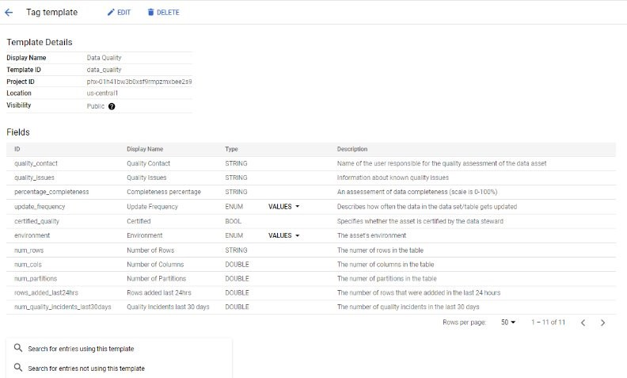

# Dataplex PoC

[Dataplex](https://cloud.google.com/blog/products/data-analytics/build-a-data-mesh-on-google-cloud-with-dataplex-now-generally-available?utm_source=youtube&utm_medium=unpaidsoc&utm_campaign=fy22q1-googlecloudevents-blog-data-description-no-brand-global&utm_content=j2hU_vkiWa0-skyvine1026739764&utm_term=-) is a data fabric from Google Cloud Platform (GCP) that “[unifies distributed data and automates its management and governance.](https://cloud.google.com/dataplex/docs/introduction)”. 

Dataplex can function as a data catalog. It automatically extracts and updates metadata and schemas from data products, making data searchable and easily accessible through a central console. Automated data quality checks ensure the reliability of the data.

In this proof-of-concept project, we explored using Dataplex to build a PHAC data mesh and data catalog using Google Cloud Storage buckets and Big Query.  We created lakes, zones and attached [synthetic data products](https://github.com/PHACDataHub/dataplex-poc/tree/main/generate-data) (assets) to examine the IAM flow and various capabilities. 

Dataplex is fully managed, scalable, and operates on a global plane. This allows data products to be added to the data mesh or catalog within their domain-specific GCP projects, granting domain owners complete control over access. Consistent metadata governance is achieved through tag templates that can be used across all products.

## How it works:

#### In the surveillance specific GCP project

* Data owners store their data products in Google Cloud Storage Buckets (in formats like Parquet, Avro, CSV, line-delimited JSON, or ORC), or BigQuery tables. These formats allow for automated schema discovery. Other formats can be used, but their schemas won't be added to Dataplex.
*Projects will come with Dataplex enabled through Infrastructure as Code (IaC), featuring one Lake and two zones (one for raw data and one for curated data). Data owners can attach the products they want to share to a Dataplex Zone as assets. Tags can be added to provide additional metadata, such as contact information for access requests. Note: This will only share the metadata and schema; users will still need to request and be granted access to view the data. 
* All users in PHAC will be granted data catalog user roles at the GCP Org folder level.
* Users can search Dataplex catalog within their own project for data sources in other in the PHAC organization. 
* Data owners assign permission to the dataplex project's service account with the Dataplex Service Agent role on the bucket, Big Query table (or project wide). This will allow Dataplex permissions to the data to extract the schema and metadata, as well as to manage IAM to the data from within the dataplex project (access would be granted by the data owner for that asset/ zone).

## How to start

### Store Data Product
1. Generate Data and store in a GCP project. 
* Store data in a Google Cloud Storage Bucket or Big Query. (Note there are connectors to store metadata from external sources, but this is out of scope for this proof of concept.)
* Dataplex can auto-extract schemas from csv, ............ formated data products. But any format should work. 
* The tables need to be compatable with Biq Query's format requirements if schemas are to be auto-extracted. (even if stored in google cloud storage as it's extracted into Big Query)
    * Curated datasets require field name characters be in the set 0-9, _,  a-z, A-Z - no spaces, brackets or hyphens are accepted. 
    * Date values cannot have '/' - replace with hyphen. 

2. Enable service APIS for DataPlex
* BigQuery API
* Cloud Dataplex API
** there may be one more 

<!-- 2. ## Set up Dataplex 

Data products (assets) can be added to Dataplex, through zones. Zones are attached to a data lake, and need to be set up first. 

1. [Create Lakes](https://cloud.google.com/dataplex/docs/create-lake) 
    *  This is the product domain (Note - We don't need the metastore as it is really for the 'Explore' feature, which we don't recomend at this point in time.)
    * Ensure the region is set to one that resides in Canada.
     

2. [Create Zones](https://cloud.google.com/dataplex/docs/add-zone). 
    * There are 2 tiers - raw zones (any format), and curated zones (strict typed format - eg BQ table/ parquet).
    * Both data types of data products can be shared with Dataplex.
    * Enable [metadata discovery](https://cloud.google.com/dataplex/docs/add-zone#:~:text=the%20same%20zone.-,Optional,-%3A%20Enable%20metadata%20discovery) is on (this should be on by default and allows Dataplex to automatically scan and extract metadata from Zone)
        * Ensure the region is set to one that resides in Canada.
  -->

3. [Add data assets](https://cloud.google.com/dataplex/docs/manage-assets#add-asset) to zones 
    * If adding from bucket, bucket location needs to be same as lake/zone.
    * Data discovery will sync regularly to update Dataplex with the most recent schema/ metadata. You can set the frequecy of this sync.
    <!-- * Attach data assets from other projects: add [IAM to bucket](https://cloud.google.com/dataplex/docs/manage-assets#role-for-bucket) and [authorize bucket to dataplex](https://cloud.google.com/dataplex/docs/create-lake#access-control) -->
    * Flag managed (if looking for  find grain security https://cloud.google.com/dataplex/docs/manage-assets#upgrade-asset )

 

4. Table Entities
    * This is where you can view metadata, schema and tags
    * Note - dataplex creates a BQ table to store metadata when the asset represents a gcs bucket.

https://cloud.google.com/dataplex/docs/quickstart-guide#create-a-lake

5. Ensure the data was added without issue. 

6. Add tags to data asset entities
* Use predefined tag templates to record data owner, contact information to request access to data and other important details such as classification, branch, etc. This can be edited at the field level. 
* Or, create a new tag template, ensure to specify required fields.
* More than one tag can be added per field.
* Indicate any PII.

## Search for data
4. Use the faceted search to seach by tag, i.e. unclassified, surveillance program, or field, i.e, 
* View the schema and metadata to see if this is what you Request access to data

5. Use big query for analysis

<!-- Data products, owned and managed by the business domains (surveillance programs), can be added to the data mesh without being moved from their respective GCP projects.  The metadata and governance for the data mesh is centrally managed from the Dataplex GCP project. 

Dataplex can be used as a data catalog where the metadata/ schema is auto-extracted and kept up-to-date with the source data product, then  searchable and findable though a central console. Data quality can be ensured with the use of automated data quality checks.

In this proof-of-concept project, we explored using Dataplex to build out a PHAC data mesh/ data catalog using Google Cloud Storage buckets and Big Query.  We created lakes, zones and attached [synthetic data products](https://github.com/PHACDataHub/dataplex-poc/tree/main/generate-data) (assets) to explore the IAM flow and various capabilities.  -->

 

<!-- ## How it works:

#### In the surveillance specific GCP project

* Data owners store their data products in Google Cloud Storage Buckets (in Parquet, Avro, CSV, line-delimited JSON, or ORC (optimized row columnar), or BigQuery tables for automated schema discovery).
* Data owners assign permission to the dataplex project's service account with the Dataplex Service Agent role on the bucket, Big Query table (or project wide). This will allow Dataplex permissions to the data to extract the schema and metadata, as well as to manage IAM to the data from within the dataplex project (access would be granted by the data owner for that asset/ zone).

#### In the Dataplex Project

* Set up the Lakes (this is done by the Dataplex Admin), Zones and assets (the data owner requires the Dataplex Viewer and Dataplex Metadata Reader roles over whole project, but only the Dataplex Data Owner role over the zone or asset they manage)
* Dataplex will then ‘discover’ data (in the bucket or BQ table) represented by the Dataplex asset - auto extracting the technical metadata and inferring the schema of the data product(s), so long as they are of compatible format. This ‘discovery’ job is run when an asset is initially added and can also be run on a cron job ensure metadata is up to date. 

## Set up

1. [Create Lakes](https://cloud.google.com/dataplex/docs/create-lake) 
    *  Lakes maps to a Data Mesh domain - here they correspond to PHAC branches (need a separate metastore per lake if using the explore features)
    * ~~[Set up a Dataproc metastore service](https://cloud.google.com/dataplex/docs/create-lake#metastore) (select 'sync to data catalog' and enable grpc)~~ (The metastore is really for the 'Explore' feature, which we don't recomend at this point in time.)
  
     

2. [Create Zones](https://cloud.google.com/dataplex/docs/add-zone) within lakes - these correspond to Surveillance Program areas. 
    * There are 2 tiers - raw zones (any format), and curated zones (strict typed format - eg BQ table/ parquet).
    * Enable [metadata discovery](https://cloud.google.com/dataplex/docs/add-zone#:~:text=the%20same%20zone.-,Optional,-%3A%20Enable%20metadata%20discovery) (allows Dataplex to automatically scan and extract metadata from Zone)
 

3. Add data assets to zones 
    * If adding from bucket, bucket location needs to be same as lake/zone.
    * Attach data assets from other projects: add [IAM to bucket](https://cloud.google.com/dataplex/docs/manage-assets#role-for-bucket) and [authorize bucket to dataplex](https://cloud.google.com/dataplex/docs/create-lake#access-control)
    * Flag managed (if looking for  find grain security https://cloud.google.com/dataplex/docs/manage-assets#upgrade-asset )
 

4. Table Entities
    * This is where you can view metadata, schema and tags
    * Note - dataplex creates a BQ table to store metadata when the asset represents a gcs bucket.
 -->

## Interesting Features

### Data Quality and Profiling 

#### Data Profiling 
Generates statistics and spread for each field – option to export to BQ table

#### [Data Quality Tasks](https://cloud.google.com/dataplex/docs/check-data-quality)
Can add assertions to datasets for data quality checks.

Uses [Data Quality Engine](https://github.com/GoogleCloudPlatform/cloud-data-quality) for inplace validation on BQ tables and GCS structured data.
* Enable dataproc API
* Enable private google access for network/subnetwork
* Can create specification yaml file and upload to a gcs bucket

#### [Auto Data Quality](https://cloud.google.com/dataplex/docs/auto-data-quality-overview)
* used data profiling (statistical analysis of data - nulls, classes, sensitive etc and suggests ruls)duplicate, missing data, outliers
* user defined rules and ql

### Tag and Tag Templates 

Tag templates are used to have consistancy accorss all data products. Tags can be public (searchable) and private (only searchable/ viewable with permissions) tags.

Tags can be are applied to the entire table (applied to every column on the table), or individual columns. In the schema view, if you click on the tag, you can view the tag values. 

### Data Catalog

The Dataplex Metadata Role will be needed. Can search using [this syntax](https://cloud.google.com/data-catalog/docs/how-to/search-reference). There's a UI you can also use filter for various tags (ie data owner/ contact, PII, column name, data type)

## Nuances 

* Curated datasets require field name characters be in the set 0-9, _,  a-z, A-Z - no spaces, brackets or hyphens are accepted. 
* Date values cannot have '/' - replace with hyphen. 
* Asset IDs must contain only lowercase letters, numbers, and/or hyphens

<!-- ### Other considerations -  -->

## Working Resources

* [dataplex in 3 parts medium article](https://medium.com/search?q=Diptiman+Raichaudhuri+dataplex)
* [Google -Build a datamesh tutorial](https://cloud.google.com/dataplex/docs/build-a-data-mesh?utm_source=youtube&utm_medium=unpaidsoc&utm_campaign=fy22q1-googlecloudevents-web-data-description-no-brand-global&utm_content=j2hU_vkiWa0-skyvine1026739764&utm_term=-)
* [Youtube overview](https://www.youtube.com/watch?v=j2hU_vkiWa0&t=970s)

